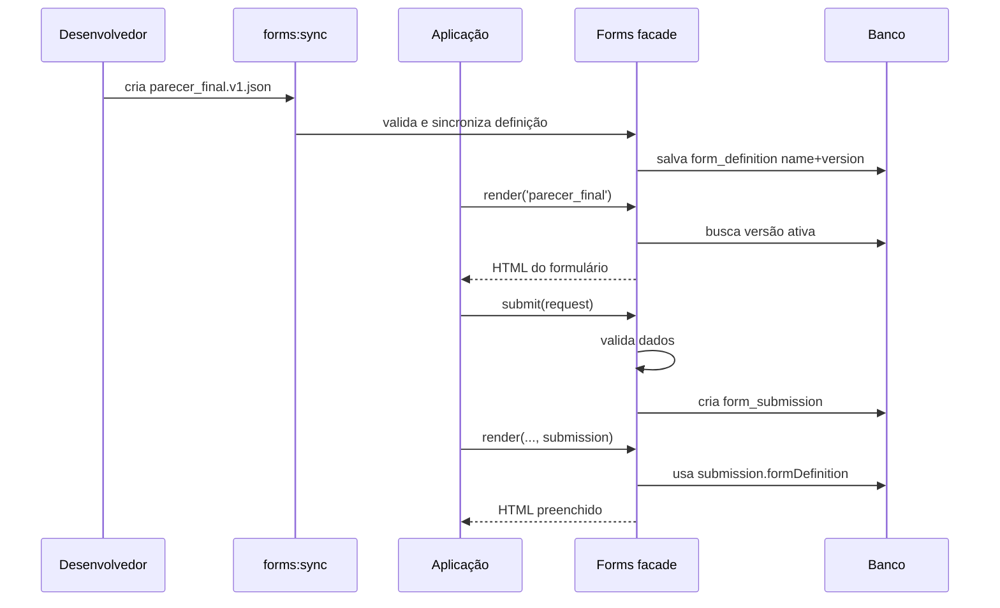

# Caso de uso completo: formulário de parecer final

Este exemplo mostra um fluxo completo usando `uspdev/forms`: criar a definição, sincronizar com o banco, renderizar o formulário, submeter dados, validar erros, editar uma submissão e consultar resultados.

## Cenário

Uma aplicação precisa coletar um parecer final de análise. O formulário terá:

* título do parecer;
* resultado da análise;
* justificativa;
* arquivo opcional.

O formulário será identificado por:

```text
name: parecer_final
version: 1
```

## 1. Criar a definição JSON

Crie um arquivo em `storage/app/formsJson/parecer_final.v1.json`.

```json
{
  "name": "parecer_final",
  "version": 1,
  "status": "active",
  "group": "workflow",
  "description": "Formulário de parecer final",
  "fields": [
    {
      "type": "separator",
      "label": "Dados do parecer"
    },
    {
      "name": "titulo",
      "type": "text",
      "label": "Título",
      "required": true,
      "validation_rule": "max:150",
      "width": 8
    },
    [
      {
        "name": "resultado",
        "type": "select",
        "label": "Resultado",
        "required": true,
        "options": [
          "aprovado",
          "reprovado",
          "pendente"
        ]
      },
      {
        "name": "data_parecer",
        "type": "date",
        "label": "Data do parecer",
        "required": true
      }
    ],
    {
      "name": "justificativa",
      "type": "textarea",
      "label": "Justificativa",
      "required": true,
      "validation_rule": "min:20"
    },
    {
      "name": "anexo",
      "type": "file",
      "label": "Anexo",
      "required": false,
      "accept": ".pdf,image/*"
    }
  ]
}
```

## 2. Sincronizar a definição

Sincronize os arquivos JSON com o banco.

```bash
php artisan forms:sync --path=storage/app/formsJson
```

Ou, pela API:

```php
use Uspdev\Forms\Facades\Forms;

$result = Forms::syncFromDirectory(storage_path('app/formsJson'));
```

O sync deve validar a definição, criar ou atualizar o registro por `name + version` e marcar `parecer_final` versão `1` como ativa.

## 3. Criar rotas da aplicação

```php
use App\Http\Controllers\ParecerController;
use Illuminate\Support\Facades\Route;

Route::get('/parecer/create', [ParecerController::class, 'create'])
    ->name('parecer.create');

Route::post('/parecer', [ParecerController::class, 'store'])
    ->name('parecer.store');

Route::get('/parecer/{submission}/edit', [ParecerController::class, 'edit'])
    ->name('parecer.edit');

Route::put('/parecer/{submission}', [ParecerController::class, 'update'])
    ->name('parecer.update');

Route::get('/parecer/{submission}/download/{field}', [ParecerController::class, 'download'])
    ->name('parecer.download');
```

## 4. Renderizar o formulário

```php
namespace App\Http\Controllers;

use Illuminate\Http\Request;
use Illuminate\Validation\ValidationException;
use Uspdev\Forms\Facades\Forms;
use Uspdev\Forms\Models\FormSubmission;

class ParecerController
{
    public function create()
    {
        $html = Forms::render('parecer_final', [
            'action' => route('parecer.store'),
            'method' => 'POST',
            'key' => 'processo-123',
        ]);

        return view('parecer.form', compact('html'));
    }
}
```

Como `version` foi omitida, a biblioteca deve usar a versão ativa de `parecer_final`.

Se a aplicação precisar prender esse fluxo à versão `1`, informe a versão explicitamente:

```php
$html = Forms::render('parecer_final', 1, [
    'action' => route('parecer.store'),
    'method' => 'POST',
    'key' => 'processo-123',
]);
```

## 5. Exibir na view

```blade
{{-- resources/views/parecer/form.blade.php --}}

@extends('layouts.app')

@section('content')
    {!! $html !!}
@endsection
```

## 6. Submeter e validar

```php
public function store(Request $request)
{
    try {
        $submission = Forms::submit($request);
    } catch (ValidationException $e) {
        return back()
            ->withErrors($e->validator)
            ->withInput();
    }

    return redirect()
        ->route('parecer.edit', $submission)
        ->with('alert-success', 'Parecer salvo com sucesso.');
}
```

Se algum campo obrigatório estiver ausente ou uma regra como `min:20` falhar, `Forms::submit()` deve lançar `ValidationException`.

## 6.1. Validar sem persistir

Se a aplicação quiser usar o formulário sem persistir os dados em `form_submissions`, use `Forms::validate()` em vez de `Forms::submit()`.

```php
public function preview(Request $request)
{
    try {
        $validated = Forms::validate($request, 'parecer_final');
    } catch (ValidationException $e) {
        return back()
            ->withErrors($e->validator)
            ->withInput();
    }

    // A aplicação decide o que fazer com os dados.
    // Ex.: enviar para uma API, calcular um resultado ou salvar em tabela própria.
    return view('parecer.preview', [
        'data' => $validated,
    ]);
}
```

Com versão explícita:

```php
$validated = Forms::validate($request, 'parecer_final', 1);
```

Esse fluxo valida os dados com as regras da definição, mas não cria `FormSubmission`.

## 7. Editar uma submissão existente

```php
public function edit(FormSubmission $submission)
{
    $html = Forms::render('parecer_final', [
        'action' => route('parecer.update', $submission),
        'method' => 'PUT',
    ], $submission);

    return view('parecer.form', compact('html', 'submission'));
}
```

Ao receber uma submissão, a biblioteca deve renderizar usando `$submission->formDefinition`. Isso preserva a versão usada no envio original, mesmo que outra versão de `parecer_final` esteja ativa.

## 8. Atualizar a submissão

```php
public function update(Request $request, FormSubmission $submission)
{
    try {
        $submission = Forms::update($request, $submission);
    } catch (ValidationException $e) {
        return back()
            ->withErrors($e->validator)
            ->withInput();
    }

    return redirect()
        ->route('parecer.edit', $submission)
        ->with('alert-success', 'Parecer atualizado com sucesso.');
}
```

## 9. Consultar submissões

Buscar todas as submissões da versão ativa:

```php
$submissions = Forms::submissions('parecer_final');
```

Buscar submissões da versão `1`:

```php
$submissions = Forms::submissions('parecer_final', 1);
```

Filtrar pareceres aprovados:

```php
$aprovados = Forms::filterSubmissions(
    'parecer_final',
    field: 'resultado',
    operator: '==',
    value: 'aprovado'
);
```

Filtrar pareceres aprovados da versão `1`:

```php
$aprovados = Forms::filterSubmissions(
    'parecer_final',
    1,
    'resultado',
    '==',
    'aprovado'
);
```

## 10. Baixar arquivo enviado

```php
public function download(FormSubmission $submission, string $field)
{
    return Forms::downloadFile($submission, $field);
}
```

Exemplo de URL:

```text
/parecer/15/download/anexo
```

## Fluxo completo



## Pontos importantes

* Omitir `version` usa a versão ativa.
* Informar `version` prende a operação a uma versão concreta.
* `Forms::validate()` valida sem persistir.
* `Forms::submit()` e `Forms::update()` validam e persistem.
* Editar ou visualizar uma submissão existente deve usar a definição relacionada à submissão.
* Igualdade em filtros usa somente o operador `==`.
* `separator` é apenas visual e não gera dado submetido.
