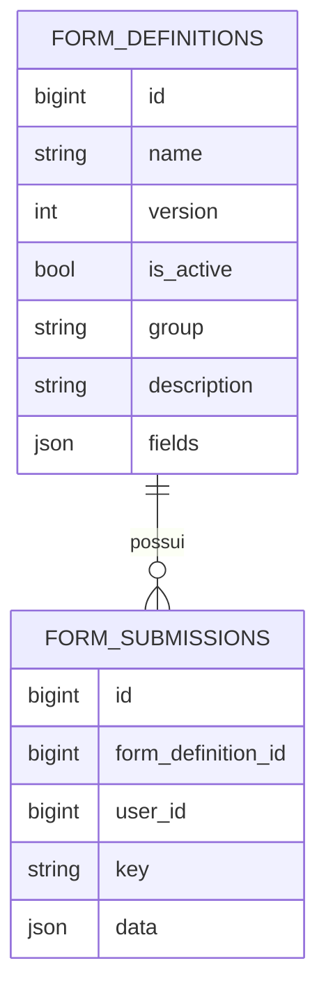

# Submissões, auditoria e relacionamento com definições

## form_submissions

Contém as submissões de formulários.

| Campo | Tipo/Observação |
| ----- | --------------- |
| id | PK |
| form_definition_id | FK para `form_definitions` |
| user_id | usuário associado, nullable |
| key | chave controlada pela aplicação |
| data | JSON com os dados submetidos |
| created_at | timestamp |
| updated_at | timestamp |
| deleted_at | soft delete |

## Regras

* `FormSubmission` não precisa de coluna `version`.
* A versão usada por uma submissão é determinada por `form_definition_id`.
* Ao criar submissão, a API resolve a definição por `name + version` ou pela versão ativa quando `version` for omitida.
* Ao renderizar ou visualizar uma submissão existente, a biblioteca deve usar `$submission->formDefinition`, nunca a versão ativa por `name`.
* Submissões antigas continuam renderizando com a definição exata usada no momento do envio.

## Auditoria

A auditoria operacional de submissões continua usando `spatie/laravel-activitylog`.

Não existe `form_submission_history` nesta versão. O histórico próprio só deve ser reavaliado se houver necessidade de diff estruturado, rollback, snapshots completos por edição ou auditoria independente do Spatie.

## Relacionamento

